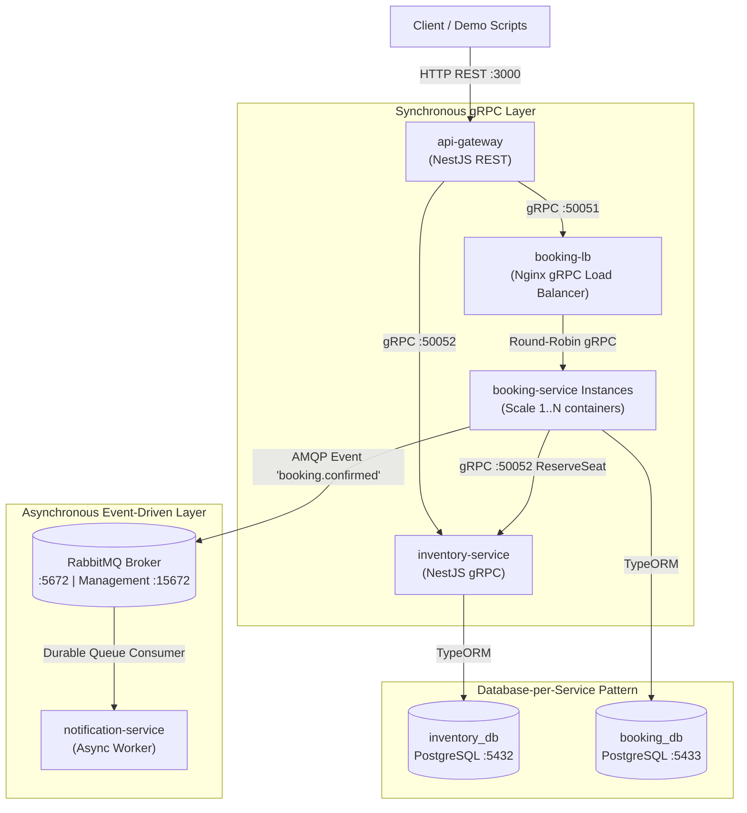

# Hệ Thống Đặt Vé Xem Phim Phân Tán (Distributed Movie Booking System)

> **Báo cáo Thực hành & Đồ án Môn học:** Các Hệ Thống Phân Tán (Distributed Systems)  
> **Kiến trúc:** Microservices, Event-Driven Architecture, Database-per-service  
> **Công nghệ cốt lõi:** NestJS, TypeScript, gRPC, RabbitMQ, PostgreSQL, Nginx, Docker & Docker Compose.

---

## 🏛️ 1. Kiến Trúc Tổng Thể Hệ Thống

Hệ thống được thiết kế theo đúng mô hình kiến trúc phân tán chuẩn doanh nghiệp:

### 📐 Sơ Đồ Kiến Trúc (Mermaid Diagram)



### 📐 Sơ Đồ ASCII Art

```text
[ Client / Demo Scripts ]
           │
           ▼ HTTP REST (Port 3000)
┌─────────────────────────────────────────────────────────────────┐
│                          api-gateway                            │
│           (Cổng vào duy nhất - Transparency Layer)              │
└────────────────┬───────────────────────────────┬────────────────┘
                 │ gRPC (:50051)                 │ gRPC (:50052)
                 ▼                               ▼
┌─────────────────────────────────┐ ┌─────────────────────────────┐
│           booking-lb            │ │      inventory-service      │
│   (Nginx gRPC Load Balancer)    │ │ (Pessimistic / Optimistic)  │
└────────────────┬────────────────┘ └──────────────┬──────────────┘
                 │ Round-Robin gRPC                │
                 ▼                                 ▼
┌─────────────────────────────────┐ ┌─────────────────────────────┐
│     booking-service (1..N)      │ │   DB: inventory_db (5432)   │
│   (Scale-out 1..3 instances)    │ └─────────────────────────────┘
└────────┬─────────────────┬──────┘
         │                 │ gRPC Call (ReserveSeat)
         │                 └───────────────────────────────┐
         │                                                 ▼
         ▼ AMQP Event (booking.confirmed)    (Xác nhận giữ chỗ ghế)
┌─────────────────────────────────┐
│            RabbitMQ             │
│    (Durable Message Broker)     │
└────────────────┬────────────────┘
                 │ Consume Event
                 ▼
┌─────────────────────────────────┐
│      notification-service       │
│    (Async Worker - Decoupled)   │
└─────────────────────────────────┘
```

---

## 🌟 2. Ánh Xạ 7 Đặc Trưng Của Hệ Thống Phân Tán Vào Dự Án

| STT | Đặc Trưng Phân Tán | Thành Phần Triển Khai Thực Tế | Giá Trị Minh Chứng |
| :--- | :--- | :--- | :--- |
| **1** | **Transparency** *(Tính trong suốt)* | `api-gateway` làm facade duy nhất | Client chỉ gọi `POST /booking`, hoàn toàn ẩn giấu 4 microservices, 2 DB, gRPC và RabbitMQ phía sau. |
| **2** | **Openness** *(Tính mở)* | `shared/protos/*.proto` | Chuẩn IDL Protobuf v3 cho phép bất kỳ ngôn ngữ nào (Go, Java, Rust) kết nối mà không đổi kiến trúc. |
| **3** | **Concurrency Control** *(Chống trùng vé)* | `inventory-service` (Pessimistic & Optimistic) | Giải quyết triệt để xung đột khi 10 người cùng đặt 1 ghế cuối. Hỗ trợ cả 2 cơ chế khoá. |
| **4** | **Scalability** *(Khả năng mở rộng)* | `docker compose up --scale booking-service=3` & Nginx | Mở rộng ngang các instance xử lý đơn hàng, Nginx round-robin gRPC tự động phát hiện container mới. |
| **5** | **Fault Tolerance & Partial Failure** | `RabbitMQ` durable queue & `notification-service` | Tắt notification-service giữa chừng, luồng đặt vé vẫn hoàn tất; khi bật lại, worker tự xử lý bù. |
| **6** | **Asynchronous Decoupling** | Message Pattern `booking.confirmed` qua AMQP | Tách rời thời gian xử lý: Đặt vé phản hồi tức thì, gửi email hoá đơn được đẩy về hậu trường. |
| **7** | **No Global Clock** | Microsecond Timestamp logging ở từng container | Minh chứng độ trễ mạng và sai lệch thời gian vật lý giữa các process/container độc lập. |

---

## 🚀 3. Hướng Dẫn Khởi Chạy Nhanh (Chỉ Với 1 Lệnh)

### Yêu cầu tiên quyết:
- Đã cài đặt **Docker** và **Docker Compose**.
- Đã cài đặt **Node.js** (v18 trở lên) để chạy kịch bản demo concurrency.

### Khởi động toàn bộ cụm hệ thống:
```bash
docker compose up -d --build
```

### Kiểm tra trạng thái các container:
```bash
docker compose ps
```
Hệ thống sẵn sàng khi các cổng sau mở:
- `api-gateway`: `http://localhost:3000`
- `inventory-service` (Health): `http://localhost:3002/health`
- `booking-service` (Health): `http://localhost:3001/health`
- `Nginx Load Balancer`: `http://localhost:8080/health` (gRPC :50051)
- `RabbitMQ Management`: `http://localhost:15672` (User/Pass: `guest` / `guest`)
- `PostgreSQL Inventory`: `localhost:5432` (DB: `inventory_db`)
- `PostgreSQL Booking`: `localhost:5433` (DB: `booking_db`)

---

## 🎬 4. Hướng Dẫn Thực Hiện 5 Kịch Bản Demo

Tất cả các kịch bản demo đã được tự động hoá trong thư mục `/demo`:

### 📌 Kịch bản 1: Kiểm chứng Transparency (Tính trong suốt)
```bash
./demo/demo-transparency.sh
```
> Client chỉ gửi 1 lệnh curl tới Gateway, nhận về thông tin vé đầy đủ từ nhiều service phân tán.

### 📌 Kịch bản 2: Kiểm chứng Concurrency Control (Chống bán trùng ghế)
```bash
node demo/demo-concurrency.js
```
> Bắn đồng thời 10 requests qua `Promise.all()` vào ghế cuối cùng `A20`.  
> **Kết quả:** Đúng 1 request thành công (`201 Created`), 9 request bị từ chối (`409 Conflict`).  
> 
> *Muốn chuyển đổi cơ chế khoá sang **Optimistic Locking**:*
> ```bash
> LOCK_STRATEGY=optimistic docker compose up -d inventory-service
> node demo/demo-concurrency.js
> ```

### 📌 Kịch bản 3: Kiểm chứng Scalability (Scale-out & Nginx Load Balancing)
```bash
./demo/demo-scale.sh
```
> Tự động scale `booking-service` thành 3 container, bắn 30 request liên tiếp và thống kê số lượng request được san đều qua từng hostname/container ID.

### 📌 Kịch bản 4: Kiểm chứng Fault Tolerance & Asynchronous Decoupling
```bash
./demo/demo-fault-tolerance.sh
```
> Tắt `notification-service`, đặt vé vẫn thành công (HTTP 201). Sau đó bật lại service và chứng kiến message trong RabbitMQ Durable Queue được xử lý bù ngay lập tức!

### 📌 Kịch bản 5: Kiểm chứng No Global Clock (Không có đồng hồ toàn cục)
```bash
./demo/demo-no-global-clock.sh
```
> Trích xuất và so sánh log timestamp của các service, giải thích hiện tượng trễ thời gian vật lý và vì sao phải dùng database transactions thay vì timestamp máy tính.

---

## 📖 5. Kịch Bản Thuyết Trình Bảo Vệ Chi Tiết

Xem hướng dẫn thuyết trình từng bước kèm lời thoại mẫu dành cho sinh viên tại file:  
👉 [`DEMO-SCRIPT.md`](file:///home/luan/Desktop/demoCacHeThongPhanTan/DEMO-SCRIPT.md)

---

## 🔌 6. Danh Mục REST API Gateway

| Method | Endpoint | Mô tả | Trạng thái phản hồi |
| :--- | :--- | :--- | :--- |
| `GET` | `/health` | Kiểm tra trạng thái hệ thống | 200 OK |
| `GET` | `/movies/:showtimeId` | Xem thông tin suất chiếu và danh sách 20 ghế | 200 OK |
| `POST` | `/booking` | Đặt vé xem phim (Body: `{ showtimeId, seatId, userName }`) | 201 Created / 409 Conflict |
| `GET` | `/booking/:id` | Tra cứu chi tiết vé theo ID | 200 OK / 404 Not Found |
| `POST` | `/dev/reset` | Đưa trạng thái ghế A20 về trống để demo lại | 200 OK |
# cachethongphantan-datvexemphim
